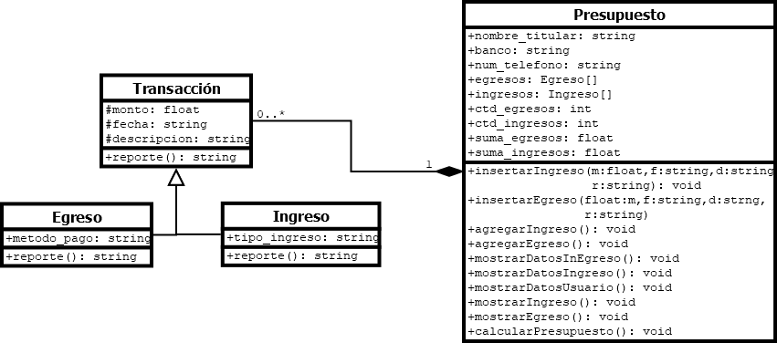

# Descripción
El presente programa es un administrador de ingresos y egresos, cuyo principal objetivo es ayudar al usuario a conocer el presupuesto aproximado que tendrá por cada cuenta bancaria que sea definida por el usuario, y así tener un control del gasto de dinero para realizar el ahorro que crea necesario hacer.
Su funcionamiento busca ser similar al de Paypal, ya como se hizo referencia, tiene la posibilidad de tener distintas cuentas bancarias en un solo lugar, y por cada cuenta, almacenar a un titular (persona que posee la cuenta), un número de teléfono y el banco al que pertenece la cuenta, y por cada cuenta se permite agregar nuevos ingresos y egresos (hasta 100 en total contando ambos).
# Modelo 📐
El programa está creado a base de cuatro clases:
- Transacción 
	- Ingreso
	- Egreso
- Presupuesto
La clase Transacción es la clase padre de Ingreso y Egreso, y además incluye un método abstracto: "reporte()", que cada clase utilizará para devolver un texto más legible y mostrarlo en pantalla. Estas clases serán una composición de la clase Presupuesto, ya dos de los atributos de esta misma son un arreglos de estas clases, y no serán creados si no es mediante sus métodos.
Finalmente, el resto de la ejecución está diseñada con un una función principal "main" y otra función definida que mostrará las opciones disponibles para que el usuario pueda administrar de forma correcta sus ingresos y gastos y analizar el presupuesto que tiene por cada cuenta que ingrese.
A continuación, se adjunta el diagrama UML de este proyecto:
 

# Uso 🧾

El programa es sencillo, iniciando con una primera cuenta sin datos del usuario, al cual se le mostrará un pequeño menú de opciones que le indica las posibilidades que se ofrecen (entre ellas, modificar la cuenta), y se le pide al usuario ingresar una opcion para comenzar a realizar dichas operaciones. 
Este deberá ser un númer entre 0 y 9 para las capacidades actuales del programa, que brinda distintas operaciones, siendo estas:

 - Crear y almacenar nuevos gastos y compras.
 - Saltar de una cuenta a otra y mostrar los datos generales para cada cuenta.
 - Mostrar el historial de los ingresos y egresos de la cuenta actual.
 - Calcular el presupuesto que posee cada cuenta.
 - Cambiar los datos del titular de la cuenta (tanto nombre como teléfono y el nombre del banco) y mostrar dicha información.
 

# Consideraciones🥸
- El menú de inicio solamente acepta los caracteres indicados por el texto que dicta las opciones, cualquier otro tipo de dato causará un error.
- La cuenta con la que inicia el programa tiene datos vacíos, por lo que se recomienda que la primera acción que tome el usuario sea modificar dicha información. Sin embargo, al crear cada nueva cuenta, serán estos los datos que se solicitarán para la creación de dicha cuenta.
- Si solamente hay una cuenta agregada, al intentar utilizar la opción para cambiar de cuentas se desplegará un pequeño mensaje de error que indica que no es posible, ya que no hay otra cuenta a la que moverse. 
- El número máximo de cuentas de 100 (no seconsidera que más cuentas sean necesarias).
- Como lo indica el programa, para terminar su proceso, ingrese un valor de "0" para finalizar su ejecución.
